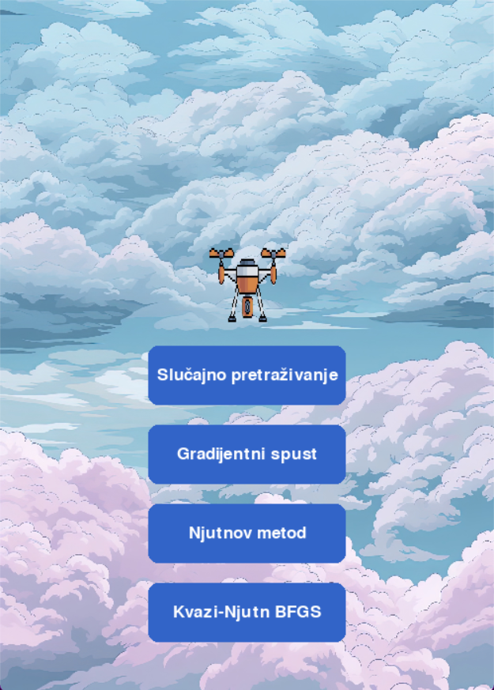
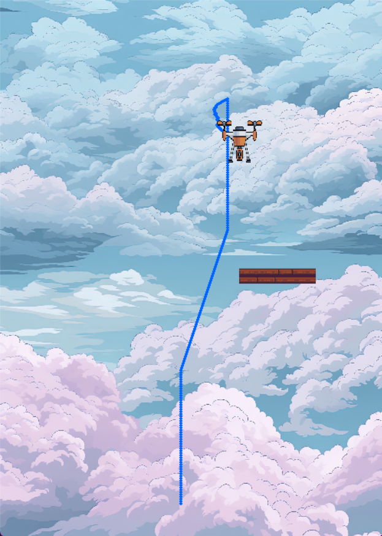
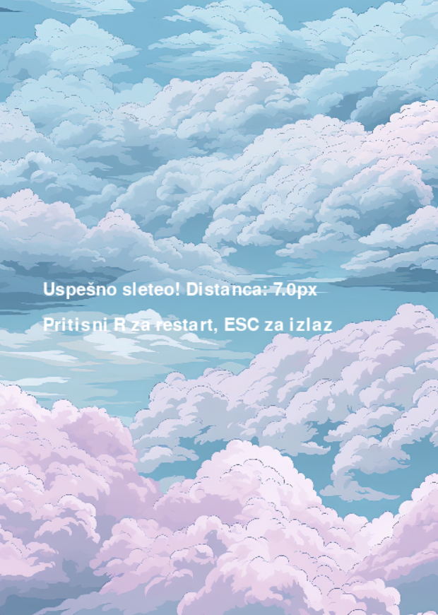
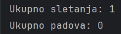

# Drone Game – Projekat iz Algoritama optimizacije u mašinskom učenju

Ovaj projekat predstavlja simulaciju sletanja drona na pokretnu platformu u Pygame okruženju. Cilj je istražiti različite optimizacione algoritme i 
demonstrirati kako dron može automatski da uči optimalno ponašanje za sigurno sletanje.

## Struktura projekta

* `main.py` – Fajl koji sadrži logiku igre koji se pokreće nakon izbora optimizacionog algoritma.
* `main_menu.py` – Glavni fajl projekta koji pokreće glavni meni, omogućava izbor algoritma optimizacije i start simulacije.
   
* `drone.py` – Sadrži klasu `Drone` sa svim funkcijama vezanim za kretanje drona, primenu algoritama i detekciju sletanja.
* `platform.py` – Sadrži klasi `Platform` sa svim funkcijama vezanim za nasumično kretanje platforme.
* `algoritmi/` – Folder koji sadrži implementacije optimizacionih algoritama.

  * `newton_method.py` – Njutnov metod za optimizaciju.
  * `gradient_descent.py` – Gradijentni spust.
  * `random_search.py` – Slučajno pretraživanje.
  * `bfgs.py` - Kvazi-Njutn BFGS metod.
    
* `slike/` – Sadrži slike.
* `Zvukovi/` - Sadrži zvuk poletanja drona.
  
## Pokretanje projekta

1. Instalirajte potrebne biblioteke:

```bash
pip install pygame numpy
```

2. Pokrenite glavni meni:

```bash
python main_menu.py
```

3. U meniju izaberite algoritam optimizacije i pokrenite simulaciju.
4. Cilj je da dron sigurno sleti na pokretnu platformu.

## Implementirani algoritmi

* **Newtonov metod** – Primenjen za horizontalno pozicioniranje drona korišćenjem drugog izvoda funkcije udaljenosti od platforme.
* **Gradijentni spust** – Iterativno pomera drona horizontalno u smeru negativnog gradijenta udaljenosti od platforme.
* **Slučajno pretraživanje** – Pomera drona nasumično horizontalno i beleži najbolje pozicioniranje u datom trenutku.
* **Kvazi-Njutn BFGS metod** - Kvazi-Njutn metoda prilagođena 1D horizontanoj kontroli drona, uzima u obzir vetar i ažurira skalarnu aproksimaciju Hesijana za stabilno sletanje.

## Funkcionalnosti

* Prikaz drona i platforme u realnom vremenu.
* Dron automatski koristi izabrani algoritam da pronađe optimalnu putanju.
* Platforma nasumično menja poziciju tokom igre.
* Vizuelni prikaz rada algoritama i zvučni efekti, kao i putanje drona, kako bi se što bolje prikazao način rada algoritama.
   
* Simulacija završava kada dron uspešno sleti ili ode van ekrana.
* Simulacija završava kada dron uspešno sleti ili padne, a na ekranu se prikazuje poruka da:
     
    * ESC izlazi iz aplikacije i ispisuje u terminalu broj uspešnih sletenja i broj padova.
    * R restartuje igru koristeći već odabrani algoritam.
     

